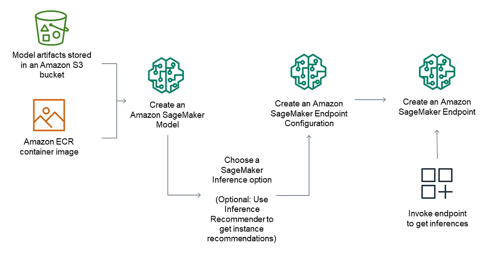

# Deploying a ML model on Amazon SageMaker

- Typically the process of build-train-deploy goes as follows:

- IAM role->Notebook instance->Notebook->Input data->Data pre-processing->Data split-> Data convert -> Data to S3 -> Choose Algorithm ->Train model -> Create reports -> Deploy model -> Check performance -> Clean up resources

# STEPS TO BUILD-TRAIN-DEPLOY MODEL IN AWS SAGEMAKER:

- STEP1: CREATE IAM ROLE AND NOTEBOOK INSTANCE

1. This IAM role automatically gets permissions to access any S3 bucket that has sagemaker in the name. It gets these permissions through the AmazonSageMakerFullAccess policy, which SageMaker attaches to the role.

2. Go to Amazon SageMaker console.

3. Select “Notebook instances” and click “Create notebook instance.”

4. Fill in details:
    - Notebook instance name: Choose a name.
    - Notebook Instance type: Use “ml.t2.medium” (or “ml.t3.medium” if unavailable).
    - Platform Identifier: Choose a platform type for OS and JupyterLab version.

5. Leave other fields with default values.

6. Complete the creation process based on preferences.

- STEP2: CREATE A JUPYTER NOTEBOOK

1. Open Jupyter or JupyterLab according to the interface needed.

2. Go to File menu->Choose New-> Notebook.

3. Select Kernel as ‘conda_python3’

- STEP 3: DOWNLOAD, EXPLORE AND TRANSFORM DATA 

- *Follow the build-train-deploy.ipynb notebook for further steps*

- STEP 7: CLEANING UP

- Delete the instances and endpoints once done as they can cause to incur charges.

    1. Inference -> Endpoints -> Actions -> Delete.
    2. Inference -> Endpoint configurations -> Actions -> Delete.
    3. Inference ->Models -> Actions -> Delete.
    4. Notebook -> Notebook Instances -> Actions -> Stop (Wait) -> Actions -> Delete.